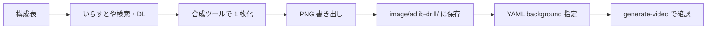

# 英語アドリブドリル — いらすとや素材の参考

> **⚠️ 運用変更**: 場面は **CapCut でいらすとやを配置**します。moviecreate への背景埋め込みは **行いません**。  
> **本番の手順**: [`adlib-drill-capcut-workflow.md`](./adlib-drill-capcut-workflow.md)  
> **素材サイト**: [かわいいフリー素材集 いらすとや](https://www.irasutoya.com/)

以下の「moviecreate 中央パネルへ PNG を載せる」節は **アーカイブ（参考）** です。

---

## 1. 方針の整理

| レイヤー | 何で表現するか |
|----------|----------------|
| **場面・状況（主役）** | いらすとやを **手動で組み合わせた 1 枚の PNG** → `scene.background` / `lines[].background` |
| **店員・同僚の英語** | VOICEVOX（ずんだもん・めたん **以外**）＋ 英語 `subtitle` |
| **生徒・先生** | ずんだもん・めたんの **立ち絵**（moviecreate 標準）＋ Part2 で模範・解説 |

いらすとやは **NPC の立ち絵の代わり**ではなく、**カフェ店内・会議室・空港カウンターなど「場」の説明**に使う。

---

## 2. いらすとやの利用（ライセンス）

利用前に必ずサイト側の規約を読む。

| 項目 | 内容 |
|------|------|
| 公式 | [いらすとや](https://www.irasutoya.com/) |
| 利用条件 | [ご利用について](https://www.irasutoya.com/p/terms.html)（改訂されるため都度確認） |
| 一般的な理解 | 無料で利用可。**著作権は放棄されていない**。再配布素材サイトへの転載は不可 |
| 本プロジェクトでの使い方 | 動画・サムネ内での **合成・加工 OK**。元 PNG の単体再配布はしない |
| 表記 | 概要欄に「イラスト：いらすとや」等のクレジットを入れる運用を推奨 |

**検索のコツ**

- カテゴリから入る: [カフェ](https://www.irasutoya.com/search?label=507)、[食べ物](https://www.irasutoya.com/search?label=119)、[旅行](https://www.irasutoya.com/search?label=128) など
- サイト内検索: 「コーヒー」「店員」「外国人」「会議」「空港」
- 英語シーン用: カテゴリ [英語](https://www.irasutoya.com/search?label=876) も参考になる

---

## 3. moviecreate の画面に載る場所（重要）

通常の `generate-video`（`global.videoFrame` **なし**）では、README および `VideoComposition` の挙動は次のとおり。

```
┌────────────────────────────────────────────────────────────┐
│  全面: 既定の黒板画像 (image/background/background.png)      │
│  ┌──────────────────────────────────────┐  ┌──┐  ┌──┐     │
│  │  中央パネル（いらすとや合成をここに）  │  │ず│  │め│     │
│  │  scene.background / line.background  │  │ん│  │た│     │
│  │  object-fit: contain                 │  │  │  │ん│     │
│  └──────────────────────────────────────┘  └──┘  └──┘     │
│  下帯: 字幕（日本語・英語 subtitle）                          │
└────────────────────────────────────────────────────────────┘
```

| 設定 | 効果 |
|------|------|
| `scenes[].background` | そのシーンの行で、中央パネルに表示する画像 |
| `lines[].background` | **その 1 行だけ**背景を差し替え（シーンより優先） |
| `global.defaultBackground` | 差し替えが無い行の既定（運用上は黒板がベースのまま） |

中央パネルの目安（1280×720 基準、`CLASSROOM_FRAME_LAYOUT.slide`）:

| 項目 | 値 |
|------|-----|
| 位置 | 左 6.5% / 上 2.2% |
| サイズ | 幅 87% / 高さ 65.5% |
| ピクセル換算 | 約 **1114 × 472 px** の矩形内に `contain` で収まる |

**合成時の推奨**

1. **キャンバス 1280×720** で作り、余白は黒板に馴染む暗めの色（`#1a1a2e` 付近）で塗る  
2. または **1114×472** に主要要素を収め、PNG として書き出して中央にフィットさせる  
3. 重要な被写体（店員・吹き出し）は **中央 80%** に収める（左右の立ち絵に被らない）

**立ち絵について**

- `characters` に `image` があるキャラ（ずんだもん・めたん）は **常に左右に表示**される（README 参照）
- Part1 をいらすとやだけに見せたくても、YAML にずんだもん／めたんを登録している限り **脇に小さく残る**
- 現実的な割り切り: **中央＝いらすとやの劇場、左右＝生徒・先生が見ている／実況** のメタ構図

---

## 4. フォルダ構成と命名

リポジトリには **いらすとやの元 PNG はコミットしない**（ライセンス・容量のため）。**合成後の PNG のみ**を置く。

```
moviecreate/
└── image/
    └── adlib-drill/
        └── drill-01-cafe-order/          # アプリ Question.id / YAML と対応
            ├── 01-hook-cafe.png          # シーン用（完成図）
            ├── 02-menu-panic.png
            ├── 03-barista-question.png   # Part1 停止点付近
            ├── 04-model-answer.png       # Part2 用（任意）
            └── SOURCES.md                # 使用したいらすとや記事 URL のメモ
```

| ファイル名 | 意味 |
|------------|------|
| `NN-説明.png` | 時系列順。`03` が Part1 の `setupEndSeconds` 付近になりやすい |
| `SOURCES.md` | どの記事からどの要素を取ったか（後から差し替えやすい） |

`SOURCES.md` の例:

```markdown
# drill-01-cafe-order

| 完成ファイル | いらすとや（記事タイトル） | URL | メモ |
|--------------|---------------------------|-----|------|
| 03-barista-question.png | カフェの店員のイラスト | https://www.irasutoya.com/20XX/XX/... | 店員を右に配置 |
| 03-barista-question.png | コーヒーを飲む人のイラスト | ... | 客席背景 |
```

---

## 5. 手動合成のワークフロー（全体）



### 5.1 構成表を先に書く（1 問あたり）

`drill-01-cafe-order` の例:

| # | シーン ID | 画面ファイル | 音声 | 英語 subtitle |
|---|-----------|--------------|------|----------------|
| 1 | hook | （Hook 演出のみ） | ずんだもん | — |
| 2 | part1_exterior | `01-hook-cafe.png` | なし or めたん短く | — |
| 3 | part1_counter | `02-menu-panic.png` | ずんだもん | — |
| 4 | part1_question | `03-barista-question.png` | **barista (VOICEVOX 8 等)** | What can I get for you today? |
| 5 | part2_model | `04-model-answer.png` or 立ち絵中心 | ずんだもん | I'd like a tall iced latte, please. |

Part1 の **最後の行** の終わりが、アプリの `setupEndSeconds` に対応する。

### 5.2 いらすとやから素材を集める

1. 構成表の「必要なモチーフ」をリスト化（例: カフェ内観、カウンター、店員、メニュー板、客）
2. [いらすとや](https://www.irasutoya.com/) で PNG をダウンロード（右クリック保存／記事ページの画像）
3. 同じテイストになるよう **線の太さ・彩度が近い** イラストを選ぶ
4. URL を `SOURCES.md` に即メモ

### 5.3 合成ツールで 1 枚にまとめる

どのツールでもよい（**レイヤー合成できるもの**）。

| ツール | 向いている人 |
|--------|----------------|
| Photoshop / Affinity Photo | レイヤー・マスク慣れ |
| GIMP（無料） | 同上 |
| Canva | テンプレから素早く |
| PowerPoint | 社内で手軽に、1280×720 スライドで配置 → PNG 書き出し |

**レイヤー例（下 → 上）**

1. 背景色 or カフェ内観（いらすとや）
2. 家具・カウンター
3. 店員（英語をかける側）
4. 客席・メニュー板（任意）
5. 英語吹き出し（いらすとやの「吹き出し」素材 or 自作白枠＋テキスト）
6. （任意）薄い枠・矢印で視線誘導

**テキスト**

- 吹き出し内の英語は **合成に入れても、必ず YAML の `subtitle` にも同文を書く**（CC・検索用）
- 日本語ナレは **入れすぎない**（アプリは動画＋CC 前提）

### 5.4 書き出し

| 項目 | 推奨 |
|------|------|
| 形式 | PNG（透過不要。中央パネル用なら不透明でよい） |
| サイズ | 1280×720、または 1114×472 以上 |
| 色 | sRGB |

### 5.5 YAML に接続

シナリオは **`scenario/adlib-drill/`** に置く（[`adlib-drill-video-direction.md`](./adlib-drill-video-direction.md) 参照）。

```yaml
# drill-meta:
#   appQuestionId: beginner-1
#   setupEndSeconds: （レンダ後に実測）
#   revealStartSeconds: （同上）

title: "【英語アドリブドリル】カフェで注文｜あなたなら？"

characters:
  zundamon:
    speakerId: 3
    image: "./image/zundamon/困り.png"
    position: left
    subtitleColor: "#88DD44"
  metan:
    speakerId: 2
    image: "./image/metan/通常.png"
    position: right
    subtitleColor: "#FF88BB"
  barista:
    speakerId: 8
    subtitleColor: "#AADDFF"

global:
  defaultBackground: "./image/background/background.png"
  bgm:
    default: "./bgm/パステルハウス.mp3"
    volume: 0.14

output:
  fps: 30
  width: 1280
  height: 720

hook:
  text: "英語で注文を聞かれて固まる"
  character: zundamon
  face: "驚き"

scenes:
  - id: "part1_menu"
    background: "./image/adlib-drill/drill-01-cafe-order/02-menu-panic.png"
    lines:
      - type: dialogue
        character: zundamon
        face: "困り"
        text: "メニューが英語だけで読めないのだ……"

  - id: "part1_question"
    background: "./image/adlib-drill/drill-01-cafe-order/03-barista-question.png"
    chapter: { label: "お題" }
    lines:
      - type: dialogue
        character: barista
        text: "What can I get for you today?"
        subtitle: "What can I get for you today?"
      - type: dialogue
        character: zundamon
        face: "驚き"
        text: "……！"

  - id: "part2_answer"
    chapter: { label: "答え合わせ" }
    lines:
      - type: dialogue
        character: zundamon
        face: "笑い"
        text: "I'd like a tall iced latte, please."
        subtitle: "I'd like a tall iced latte, please."
      - type: dialogue
        character: metan
        text: "I'd like は丁寧で自然。Can I have でも通るわ。"
```

パスは **シナリオ YAML があるディレクトリ基準の相対パス**（moviecreate README 準拠）。`generate-video` 実行時はリポジトリルートから行う想定なら、`./image/...` で問題ない。

### 5.6 プレビューと秒数の確定

```bash
# リポジトリルートで
node dist/cli.js generate-video scenario/adlib-drill/drill-01-cafe-order.yaml
```

1. 出力 MP4 を再生し、**Part1 終端**（店員の英語の直後）の秒数をメモ → `setupEndSeconds` / `revealStartSeconds`
2. YouTube 公開後 `videoId` を `ENGLISH_AD-LIB_DRILL` の `stages.ts` に記入
3. アプリで Part1 停止・Part2 必須視聴を実機確認

---

## 6. カット割りのパターン（いらすとや活用）

| パターン | やり方 | 向くシーン |
|----------|--------|------------|
| **A. 1 シーン 1 枚** | `scenes[].background` を差し替え | 場面がはっきり変わるとき |
| **B. 1 行 1 枚** | `lines[].background` で細かく切る | 同じ店で表情だけ変える |
| **C. 中央はいらすとや、Part2 は立ち絵中心** | Part2 から `background` を外す | 解説・模範はめたん＋ずんだもん |
| **D. emphasis で英語を叩く** | イラストはそのまま、`lines[].emphasis` | 聞き取りポイントの強調 |

```yaml
- type: dialogue
  character: barista
  text: "What can I get for you today?"
  subtitle: "What can I get for you today?"
  emphasis:
    - "What can I get"
```

---

## 7. やってはいけないこと

| NG | 理由 |
|----|------|
| いらすとや PNG を素材パックとして再配布 | 利用規約違反の恐れ |
| Part1 で模範英語を画面に出す | アプリのネタバレ |
| `subtitle` なしで英語だけ合成 | CC・聴覚障害・アプリ連携が弱くなる |
| 現場English の長尺構成をそのまま流用 | プレイリスト・尺が別物（方向性ドキュメント参照） |
| 店員をずんだもん声で喋らせる | 進行役／生徒役の役割分担と矛盾 |

---

## 8. チェックリスト（1 問完成時）

- [ ] 構成表と `SOURCES.md` がある
- [ ] Part1 最終カットで英語の問いかけが終わっている
- [ ] 合成 PNG が `image/adlib-drill/` にある
- [ ] YAML の `background` が通り、`generate-video` が成功する
- [ ] `setupEndSeconds` / `revealStartSeconds` を実測した
- [ ] YouTube CC を付けた
- [ ] 概要欄にいらすとやクレジット（任意だが推奨）

---

## 9. 関連ドキュメント

| ドキュメント | 内容 |
|--------------|------|
| [`adlib-drill-video-direction.md`](./adlib-drill-video-direction.md) | 1本2区間・プレイリスト分離・キャラ役割 |
| [`README.md`](../README.md) | `background` / `characters` / `generate-video` |
| [`audio-assets.md`](./audio-assets.md) | BGM / SE |

---

*最終更新: 2026-05-17*
